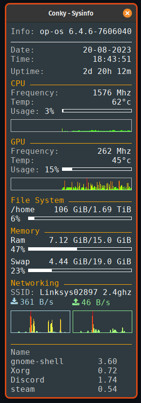

# Conky-Sysinfo-conf

my personal conky configs

With System infomation like cpu, gpu, ram, file systems, networking and system processes

## Screenshot



## Requires
Insure that you have installed

* conky

* Font Awesome

For Debian/Ubuntu

```bash
sudo apt update
sudo apt install fonts-font-awesome conky-all
```
For Arch

Use an AUR helper to install `ttf-font-awesome conky-lua-nv`

## Installation

- git clone the repository to `~/.conky` or a directory you like

   - if `~/.conky` doesn't exist then create it
   - Open terminal and type

```bash
mkdir -p ~/.conky
cd ~/.conky
git clone https://github.com/Im-shamo/Conky-Sysinfo-conf.git
cd ./Conky-Sysinfo-conf
```
- Then edit the file `conky_open.sh`

   - edit line 5 of the script

```
# Change "$HOME/.conky" to where you git clone the repository
dir="$HOME/.conky"
```
   - chmod and execute `conky_open.sh`

```bash
sudo chmod +x ./conky_open.sh
./conky_open.sh
```

- edit the networking section if network doesn`t work

   - run this command

```bash
nmcli dev status
```


- get your network device. It will be like `wlo1` or `wlan0`
   - go to `conky_sysinfo.conf` and change all the `wlo1` to your device in that section
